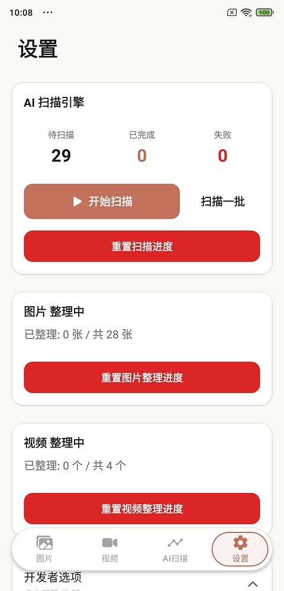

# PickPic 📸

> An immersive photo organizing tool based on liquid glass aesthetics, making memory cleanup a therapeutic experience.


---

## 📱 App Screenshots

<p align="center">
  <a href="assets/screenshots/photo-organizer.jpg">
    
  </a>
  &nbsp;&nbsp;
  <a href="assets/screenshots/ai-scan-settings.jpg">
    
  </a>
</p>

<p align="center">
  <sub>Card-style Photo Organizing &nbsp;·&nbsp; AI Scan and Organizing Progress</sub>
</p>

---

## ✨ Feature Highlights

### 📷 Card-style Photo Organizing
Organize your album like you're swiping on Tinder!

- ⬆️ **Swipe Up to Delete** - Quickly remove photos you don't want.
- ⬇️ **Swipe Down to Keep** - Safely skip precious memories.
- Batch confirmation to prevent accidental deletions.

### 🎬 TikTok-style Video Browsing
An immersive full-screen experience for browsing your video library.

- One-click delete / favorite / share.
- Trash bin double-confirmation mechanism.
- Long press to enter full-screen mode.

### ⚙️ Personalized Settings
- **Batch Size**: Adjustable (10 / 20 / 30 photos per group).
- **Random Mode**: Shuffle order to revisit old times.
- **Theme Switching**: Light / Dark / Follow System.
- **Bilingual Support**: Chinese / English.
- **Progress Tracking**: Resume from where you left off.

### 🔍 AI Scanning Engine (New in v0.3.0)
- **Blur Detection**: Automatically identify blurry photos.
- **Similarity Grouping**: Intelligently find duplicate or similar photos.
- **Smart Classification**: Can be enabled in Developer Options (Beta, accuracy is being continuously optimized).
- **Performance Optimization**: AI classification is off by default for faster scanning speeds.
- **🔒 Privacy & Security**: Fully processed locally; no internet connection required, no data uploaded.

---

## 🚀 Quick Start

### Environment Requirements
- Node.js 18+
- Expo CLI

### Installation and Running
```bash
# Clone the project
git clone https://github.com/1Beyond1/PickPic.git
cd PickPic

# Install dependencies
npm install

# Start the development server
npx expo start
```

### Build APK
```bash
# Cloud Build (Recommended)
npx eas build -p android --profile preview

# Local Build (Requires Android SDK configuration)
eas build --platform android --profile preview --local
```

---

## ⚠️ Notices

1. **Permanent Deletion Risk**: On some device models (e.g., Xiaomi), deleted files may be purged directly and cannot be recovered!
2. **Cloud Sync Limitations**: If Xiaomi Cloud/iCloud is enabled, this app can only delete local files; cloud services may automatically restore them.
3. **Beta Version**: Currently v0.3.1. If you encounter any bugs, feel free to provide feedback!

---

## 🛠️ Tech Stack

| Category | Technology |
|----------|------------|
| Framework | React Native + Expo SDK 54 |
| Navigation | Expo Router |
| State Management | Zustand |
| Animation | React Native Reanimated |
| Gestures | React Native Gesture Handler |
| Media | expo-media-library, expo-av |

---

## 👤 Author

**1Beyond1**

[](https://github.com/1Beyond1)

---

## 📝 License

This project is open-sourced under the [MIT](LICENSE) license.

---

**⭐ If you find this useful, feel free to Star for support!**
