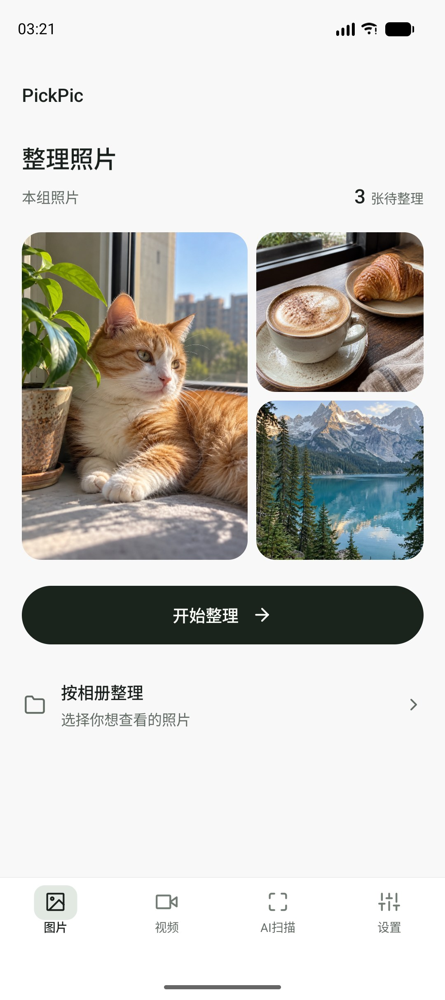
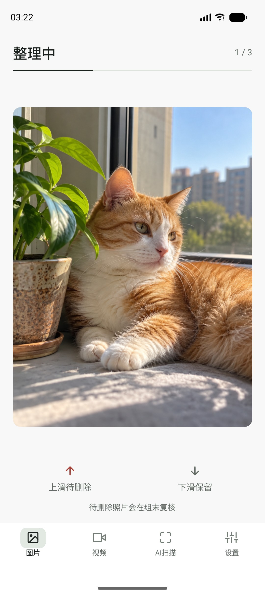
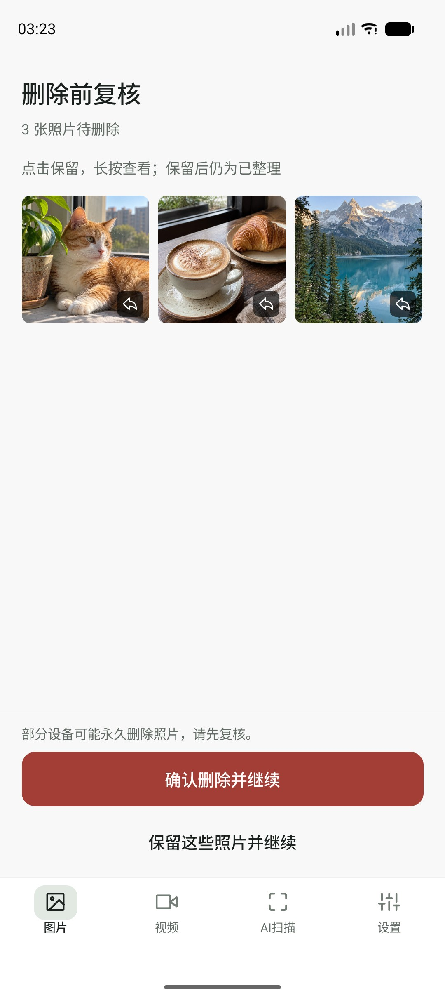
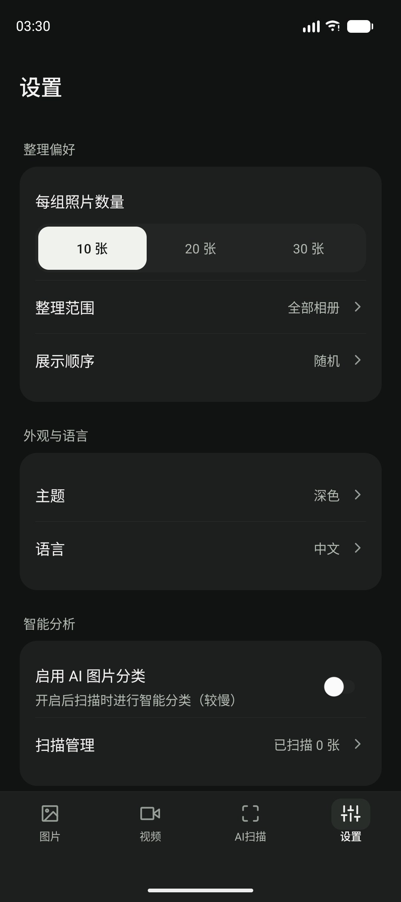

# PickPic 📸

> 在本地整理照片与视频，以克制的浅色 / 深色界面，把每一次保留和删除决定看清楚。


---

## 📱 应用截图

<p align="center">
  <a href="assets/screenshots/photo-home.jpg">
    
  </a>
  &nbsp;&nbsp;
  <a href="assets/screenshots/photo-organizer.jpg">
    
  </a>
</p>

<p align="center">
  <a href="assets/screenshots/photo-review.jpg">
    
  </a>
  &nbsp;&nbsp;
  <a href="assets/screenshots/settings-dark.jpg">
    
  </a>
</p>

<p align="center">
  <sub>v0.4.0 · Android 模拟器实际运行截图。湖景、猫与咖啡为 AI 生成的展示素材，不包含用户真实图库；截图未经 UI 拼接。</sub>
</p>

---

## ✨ 功能亮点

### 📷 卡片式照片整理
逐张浏览，按批次整理，并在真正删除前复核。

- ⬆️ **上滑待删**：加入待删队列，此时不会删除原照片
- ⬇️ **下滑保留**：保留原照片，并记录为已整理
- **删除前复核**：点击某张缩略图，只将这一张改为保留，仍算已整理；留在复核页，可连续操作。长按查看大图
- **分页与完成**：待删数量随操作更新，末页清空后退到前页；全部保留后显示本组完成，点击继续才加载下一批
- **最终确认**：只有点击确认删除才会请求系统删除；操作前请阅读下方风险说明

### 🎬 抖音风格视频浏览
全屏沉浸式刷自己的视频库

- 滑动切换，静音 / 收藏 / 分享与待删操作
- 仅打开或离开视频页不会自动记为已整理；完成切换或明确整理操作才记录
- 已整理视频允许滑回查看，整理记录不因此撤销
- 末项提示与废纸篓二次确认；加入废纸篓不等于永久删除
- 长按进入全屏模式

### ⚙️ 个性化设置
- **每组数量**：10 / 20 / 30 张可调
- **浏览顺序**：最新优先 / 最早优先 / 随机
- **相册范围**：全部相册或指定相册
- **主题切换**：浅色 / 深色，旧主题设置迁移为浅色
- **双语支持**：中文 / English
- **进度追踪**：断点续整，随时继续
- **数据管理**：分别查看和重置照片整理、视频整理及扫描记录；重置记录不会删除原媒体

### 🔍 AI 扫描引擎
- **模糊检测**：自动识别模糊拍摄的照片
- **相似分组**：智能找出重复/相似照片
- **智能分类**：在“设置 → 智能分析 → 启用 AI 图片分类”中开启（Beta，默认关闭）
- **模型状态**：本次未更换模型；优化了分类证据汇总与临时图片清理。分类仅供复核参考，不会自动删除媒体
- **🔒 本地分析**：图像分析在设备上运行，不会向云端 AI 服务上传照片或视频

### 最近更新（2026-10-02，v0.4.0）

- 统一浅深主题、设置分组、底部弹层和安全区域；保留熟悉的视频侧边操作栏
- 复核单张改为保留且保持已整理，不再跳回整理页；保留分页和整组确认范围
- 照片与视频读取失败不再误报为空库；照片大图、复核预览和相似组提供错误提示及重试
- 补充自动化回归与异步状态保护；Android API 37 development build 已用于隔离体验检查，但并非所有路径都完成原生验证

当前源码版本不代表已经发布新的 APK。AI 分类仍为 Beta，结果需要人工复核。

---

## 🚀 快速开始

### 环境要求
- Node.js 20.19.4+（运行当前真实 SQLite 自动化测试推荐 Node.js 24.11.1）
- npm（Expo CLI 通过项目依赖的 `npx expo` 使用）
- 本地 Android 开发构建：JDK 17、Android SDK，以及 Android 模拟器或手机
- 本地 iOS 构建：macOS 与 Xcode；本轮尚未完成 iOS 原生验收

### 安装运行
```bash
# 克隆项目
git clone https://github.com/1Beyond1/PickPic.git
cd PickPic

# 按锁文件安装依赖
npm ci

# 首次构建并安装 Android development build
npm run android

# 后续只改 JS / TS 时，启动开发服务器连接已安装的构建
npx expo start --dev-client
```

项目包含 ML Kit 原生模块，不能仅用 Expo Go 预览完整应用。添加或修改原生依赖后需重新构建 development build；普通界面改动可通过 Metro 更新。参见 [Expo 原生代码与开发构建说明](https://docs.expo.dev/workflow/customizing/)。

### 自动化检查

```bash
npm run typecheck
npm run lint
npm run test:ci
```

### 构建 APK
```bash
# 云端构建可独立安装的预览 APK（需 Expo 账号及 EAS 项目权限）
npx eas-cli build -p android --profile preview

# 本地 Android 开发 APK（需配置 JDK / Android SDK）
# 是 development build，需要 Metro，不等同于独立发布 APK
npm run android

# macOS / Linux 的本地 EAS 预览 APK 构建
npx eas-cli build --platform android --profile preview --local
```

Windows 原生环境使用 Expo CLI 构建 Android development build；不要直接在 PowerShell 中将 EAS `--local` 当作已支持的 Windows 发布流程。EAS 本地构建的平台支持及 WSL 限制见 [Expo 官方文档](https://docs.expo.dev/build-reference/local-builds/)。当前 `preview` 配置输出 APK，`production` 配置输出 AAB。

---

## ⚠️ 使用须知

1. **永久删除风险**：最终删除在部分设备上可能直接清除文件，而不是移到系统回收站。请先复核，并自行备份重要媒体。
2. **云同步限制**：本应用不管理云端备份。云同步服务可能重新下载媒体，也可能同步本机删除决定；请以所用服务的实际行为为准。例如 [iCloud 照片删除会同步到其他设备](https://support.apple.com/en-nz/104967)。
3. **测试版本**：目前为 v0.4.0，如遇 Bug 欢迎反馈！

## 🔐 提交与隐私

- 不提交 `.env`、访问令牌、API 密钥、签名密钥或本机 SDK 配置；`.gitignore` 已排除常见本地配置及构建目录
- 不提交真实图库、App 数据库、含个人信息的日志和测试截图；反馈问题前请脱敏
- 忽略规则不能清除已经提交的秘密。如果误提交凭据，应先撤销 / 轮换，再处理 Git 历史

---

## 🛠️ 技术栈

| 类别 | 技术 |
|------|------|
| 框架 | React Native + Expo SDK 54 |
| 导航 | Expo Router |
| 状态管理 | Zustand |
| 动画 | React Native Reanimated |
| 手势 | React Native Gesture Handler |
| 媒体 | expo-media-library, expo-video |

---

## 👤 作者

**1Beyond1**

[](https://github.com/1Beyond1)

---

## 📝 许可协议

项目原创代码基于 [Apache License 2.0](LICENSE) 开源，署名信息见 [NOTICE](NOTICE)。第三方依赖与模型沿用各自许可证。

---

**⭐ 如果觉得有用，欢迎 Star 支持！**
